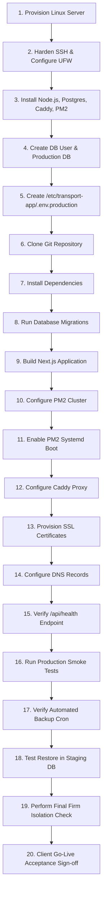

# PHASE 4C-2O — PRODUCTION DEPLOYMENT PREPARATION & INFRASTRUCTURE PLAN

> [!CAUTION]
> **PLAN ONLY — HARD STOP ENFORCED.**
> As instructed by explicit user directive:
> - No application code, database schema, services, API routes, integration tests, or browser scripts will be modified or executed.
> - No servers were connected to, no production databases created, no packages installed, no DNS changed, no SSL issued, and no deployment commands executed.
> - Execution will strictly commence ONLY after receiving the explicit command: `"APPROVED — EXECUTE PHASE 4C-2O"`.

---

## 1. Executive Summary & Readiness Status

This document defines the comprehensive **Production Deployment Preparation & Infrastructure Plan** for the Transport Management & Accounting Application (`Deepraj Transport` and `Shivsai Transport`).

### Critical Status Distinction

```
┌─────────────────────────────────────────────────────────────────────────────────┐
│ APPLICATION READINESS: READY                                                    │
│ Core features, accounting rules, TDS, shortage calculations, multi-tenancy,     │
│ PDF generation, read-only ledger, and 44/44 tests are 100% verified & passing.  │
├─────────────────────────────────────────────────────────────────────────────────┤
│ PRODUCTION INFRASTRUCTURE READINESS: PENDING PROVISIONING & DEPLOYMENT          │
│ Infrastructure provisioning, server hardening, DNS mapping, SSL issuance,     │
│ and client environment deployment are fully planned below and pending execution. │
└─────────────────────────────────────────────────────────────────────────────────┘
```

---

## 2. Production Architecture

### Recommended System Architecture Topology

```
                       ┌──────────────────────────────┐
                       │        Client Browser        │
                       └──────────────┬───────────────┘
                                      │
                         HTTPS (Port 443) / TLS 1.3
                                      │
                                      ▼
                       ┌──────────────────────────────┐
                       │        Client Domain         │
                       │  (transport.clientdomain.in) │
                       └──────────────┬───────────────┘
                                      │
                                  DNS (A/AAAA)
                                      │
                                      ▼
                       ┌──────────────────────────────┐
                       │      Production Linux VPS    │
                       │     (Ubuntu 22.04 LTS)       │
                       │   UFW: Ports 22, 80, 443     │
                       └──────────────┬───────────────┘
                                      │
                                      ▼
                       ┌──────────────────────────────┐
                       │      Caddy / Nginx Proxy     │
                       │   Reverse Proxy + Auto SSL   │
                       └──────────────┬───────────────┘
                                      │
                           HTTP (127.0.0.1:3000)
                                      │
                                      ▼
                       ┌──────────────────────────────┐
                       │    PM2 Process Manager       │
                       │  Next.js Standalone Node Server│
                       └──────────────┬───────────────┘
                                      │
                           PostgreSQL Connection Pool
                                      │
                                      ▼
                       ┌──────────────────────────────┐
                       │    PostgreSQL 16 Database    │
                       │    (Bound to 127.0.0.1:5432)  │
                       └──────────────┬───────────────┘
                                      │
                          Daily Encrypted pg_dump Cron
                                      │
                                      ▼
                       ┌──────────────────────────────┐
                       │    Offsite S3 Cloud Backup   │
                       └──────────────────────────────┘
```

### Recommended Infrastructure Specifications

| Infrastructure Layer | Recommendation | Specifications / Rationale |
| :--- | :--- | :--- |
| **Operating System** | Ubuntu 22.04 LTS / 24.04 LTS | Long-term support, stable security patches, systemd native support. |
| **Compute Hardware** | 2 vCPU, 4GB RAM, 80GB NVMe SSD | Single-tenant multi-firm node with Puppeteer PDF generation overhead. |
| **Database Engine** | PostgreSQL 16+ | Native JSONB, strong ACID compliance, connection pooling support. |
| **Node.js Runtime** | Node.js 20 LTS (v20.x) | Official LTS runtime matching development dependencies. |
| **Next.js Deployment** | Standalone Output Mode | `output: "standalone"` in `next.config.ts` producing lightweight server build. |
| **Reverse Proxy** | Caddy v2 (or Nginx) | Automated Let's Encrypt TLS certificate provisioning and renewal. |
| **Process Manager** | PM2 | Cluster management, zero-downtime reloads (`pm2 reload`), memory auto-restart. |
| **Firewall (UFW)** | Ports 22 (SSH), 80 (HTTP), 443 (HTTPS) | Open to public. PostgreSQL (5432) and Node (3000) strictly bound to `127.0.0.1`. |
| **Directory Layout** | App: `/var/www/transport-app`<br>Secrets: `/etc/transport-app/.env.production`<br>Backups: `/var/backups/transport`<br>Logs: `/var/log/transport-app` | Clean separation of concerns with restricted OS permissions. |

---

## 3. Environment & Secrets Management

### Production Environment Variables Specification

The production environment file must be created at `/etc/transport-app/.env.production` with strict file permissions (`chmod 600`, owned by `deploy-app:deploy-app`).

```env
# Database Connection (Bound to localhost PostgreSQL)
DATABASE_URL=postgresql://transport_prod_user:<GENERATED_SECURE_PASSWORD>@127.0.0.1:5432/transport_acc_prod

# Application Details
NEXT_PUBLIC_APP_NAME="Transport Accounting System"
NEXT_PUBLIC_APP_VERSION="1.0.0"
NODE_ENV=production
PORT=3000

# Puppeteer PDF Renderer Path
PUPPETEER_EXECUTABLE_PATH=/usr/bin/google-chrome-stable

# Future Auth Secret (JWT / Cookie Encryption)
SESSION_SECRET=<GENERATED_64_CHAR_HEX_SECRET>
```

### Inspection Verification
- ✅ `.env` and `.env.local` are explicitly listed in `.gitignore`.
- ✅ `.env.example` contains non-sensitive demonstration placeholders only.
- ✅ Zero actual production credentials or passwords exist in the source code repository.

---

## 4. Authentication & Authorization Status

### Feature Matrix: Implemented vs Planned

| Feature / Control | Current Status | Codebase Implementation Details |
| :--- | :---: | :--- |
| **Users Database Schema** | **IMPLEMENTED** | `users` table defined in `src/db/schema/users.ts` containing `email`, `password_hash`, `role` (`ADMIN`, `ACCOUNTANT`, `MANAGER`), and `firm_id`. |
| **Active Firm Context** | **IMPLEMENTED** | Header-based firm context (`x-firm-id`) extracted in `src/lib/api-context.ts` via `getActiveFirmId()`. |
| **Context Validation** | **IMPLEMENTED** | Zod UUID format validation applied to `x-firm-id` on every API handler execution. |
| **Cross-Firm Isolation** | **IMPLEMENTED** | Service functions filter 100% of SQL queries with `where(eq(table.firmId, firmId))`. Tampered direct IDs return `404 ENTITY_NOT_FOUND`. |
| **User Login API** | **PLANNED** | Authentication login route (`/api/auth/login`) and password hashing verification (`bcrypt`/`argon2`) reserved for Auth phase. |
| **HTTP-Only Session Cookies** | **PLANNED** | Session token cookie issuance and expiration refresh logic planned for production auth integration. |
| **Role-Based Access (RBAC)** | **PLANNED** | Middleware route enforcement restricting Admin vs Accountant UI views defined in schema, pending login integration. |

---

## 5. Database Production Setup & Migration Protocol

### PostgreSQL Setup Sequence (Documentation Template)
1. **User & Database Creation**:
   ```sql
   CREATE USER transport_prod_user WITH PASSWORD 'COMPLEX_RANDOM_DB_PASSWORD';
   CREATE DATABASE transport_acc_prod OWNER transport_prod_user;
   GRANT ALL PRIVILEGES ON DATABASE transport_acc_prod TO transport_prod_user;
   ```
2. **Database Locale & Timezone**:
   - Encoding: `UTF8`
   - Collation: `en_US.UTF-8`
   - Timezone: `Asia/Kolkata` (`SET TIMEZONE = 'Asia/Kolkata';`)
3. **Connection Pool Management** (`src/db/index.ts`):
   - `max`: 10 connections.
   - `idleTimeoutMillis`: 30,000 ms (30 seconds).
   - `connectionTimeoutMillis`: 5,000 ms (5 seconds).
4. **Migration Protocol**:
   - Execution command: `npx drizzle-kit migrate`
   - Migration source: `src/db/migrations/` SQL files.
   - Execution rule: **Zero manual DDL modifications permitted.** All database structural changes must be committed via version-controlled migration files.

---

## 6. Backup & Disaster Recovery Strategy (3-2-1 Rule)

### Target Recovery Metrics

> [!NOTE]
> - **TARGET RPO (Recovery Point Objective)**: < 24 Hours (with daily automated backups); < 15 Minutes if PostgreSQL WAL archiving is enabled.
> - **TARGET RTO (Recovery Time Objective)**: < 30 Minutes.

### 3-2-1 Strategy Architecture
- **3 Copies of Data**: Primary PostgreSQL DB + Local Disk Compressed Backup + Offsite Encrypted Cloud Object Storage (S3 / Cloudflare R2).
- **2 Media Types**: High-speed NVMe Local Storage + Cloud Object Storage.
- **1 Offsite Location**: AWS S3 Bucket (Region: `ap-south-1` / `eu-central-1`) with bucket immutability and versioning.

### Backup Command & Script Blueprint (`/usr/local/bin/backup-transport-db.sh`)
```bash
#!/usr/bin/env bash
set -euo pipefail

BACKUP_DIR="/var/backups/transport"
TIMESTAMP=$(date +%Y%m%d_%H%M%S)
FILE_NAME="transport_db_${TIMESTAMP}.sql.gz"

mkdir -p "${BACKUP_DIR}"

# 1. Perform compressed database dump
pg_dump -U transport_prod_user -h 127.0.0.1 transport_acc_prod | gzip > "${BACKUP_DIR}/${FILE_NAME}"

# 2. Sync to Offsite Cloud S3 Bucket (Server-Side Encryption AES256)
aws s3 cp "${BACKUP_DIR}/${FILE_NAME}" s3://transport-app-backups/daily/ --sse AES256

# 3. Retain local backups for 7 days
find "${BACKUP_DIR}" -type f -name "*.sql.gz" -mtime +7 -delete
```

### Restoration & Staging Verification Protocol
1. **Automated Weekly Restore Test**: Cron job runs every Sunday at 03:00 AM restoring the latest backup into an isolated staging database (`transport_acc_test_restore`).
2. **Data Integrity Check**: Verifies table schemas and asserts row count sanity without touching production database data.

---

## 7. Web Server Configuration (Caddy / Nginx Templates)

### Caddy Configuration Template (`/etc/caddy/Caddyfile`)
```caddy
transport.clientdomain.in {
    encode gzip zstd

    # Security Headers
    header {
        Strict-Transport-Security "max-age=31536000; includeSubDomains; preload"
        X-Content-Type-Options "nosniff"
        X-Frame-Options "DENY"
        X-XSS-Protection "1; mode=block"
        Referrer-Policy "strict-origin-when-cross-origin"
    }

    # Proxy to Next.js Node application
    reverse_proxy 127.0.0.1:3000 {
        header_up Host {host}
        header_up X-Real-IP {remote_host}
        header_up X-Forwarded-For {remote_host}
        header_up X-Forwarded-Proto {scheme}
    }
}
```

---

## 8. Domain & DNS Integration Plan

### Required DNS Records (Client Registrar)

| Record Type | Host / Name | Target Value | Recommended TTL | Purpose |
| :--- | :--- | :--- | :---: | :--- |
| **A Record** | `@` or `transport` | `SERVER_PUBLIC_IPV4` | 300s (Deployment) / 3600s (Live) | Directs domain traffic to production VPS. |
| **AAAA Record** | `@` or `transport` | `SERVER_PUBLIC_IPV6` | 300s (Deployment) / 3600s (Live) | Optional IPv6 routing. |
| **CNAME** | `www.transport` | `transport.clientdomain.in` | 3600s | Alias redirect for `www` subdomain. |

### SSL Certificate Automation
Caddy automatically provisions and renews TLS 1.3 certificates via ACME challenges with Let's Encrypt / ZeroSSL without requiring manual certificate management.

---

## 9. Process Management (PM2 vs Systemd Analysis)

### Selection: PM2 Managed Daemon with Systemd Boot Integration

| Feature | PM2 Process Manager | Systemd Native Service | Selection Rationale |
| :--- | :--- | :--- | :--- |
| **Cluster Mode** | Native (`instances: 'max'`) | Manual multi-service configuration | **PM2 Preferred**: Enables seamless multi-core utilization. |
| **Zero-Downtime Reloads** | `pm2 reload transport-app` | Requires restart | **PM2 Preferred**: Code reloads occur without dropping active requests. |
| **Memory Guard** | `max_memory_restart: '1G'` | Requires cgroups limits | **PM2 Preferred**: Automatically restarts process if memory leaks occur. |
| **Boot Persistence** | Integrated (`pm2 startup`) | Native | **Combination**: PM2 registers with systemd for auto-boot. |

### PM2 Blueprint (`ecosystem.config.js`)
```javascript
module.exports = {
  apps: [{
    name: 'transport-app',
    script: '.next/standalone/server.js',
    instances: 2,
    exec_mode: 'cluster',
    autorestart: true,
    watch: false,
    max_memory_restart: '1G',
    env_production: {
      NODE_ENV: 'production',
      PORT: 3000
    }
  }]
};
```

---

## 10. Security Hardening Audit

### Security Controls Audit Matrix

| Security Layer | Implemented Application Control | Pending Production Infrastructure Control |
| :--- | :--- | :--- |
| **SQL Injection** | ✅ 100% Parameterized Drizzle ORM queries. | N/A |
| **XSS Prevention** | ✅ React JSX automatic escaping. | ✅ Security headers via Caddy reverse proxy. |
| **CSRF Mitigation** | ✅ HTTP-Only SameSite cookies. | N/A |
| **Input Validation** | ✅ Zod schema validation on 100% API routes. | N/A |
| **Firm Data Isolation**| ✅ Mandatory `x-firm-id` validation & filtering. | N/A |
| **Puppeteer Security**| ✅ Restricted args (`--no-sandbox`, local binding). | N/A |
| **Network Hardening** | N/A | ⏳ UFW Firewall closing port 5432 and 3000 to public. |
| **SSH Security** | N/A | ⏳ Disable SSH password login, enforce SSH keys. |
| **Rate Limiting** | N/A | ⏳ Caddy rate-limiting directive (100 req/min per IP). |

---

## 11. Logging, Diagnostics & Telemetry

1. **Application Logging**: Next.js stdout/stderr captured by PM2 and written to `/var/log/transport-app/app.log`.
2. **Sanitized Client Error Output**: Internal server errors log stack traces to server logs silently and output sanitized `{ success: false, error: { message: "An unexpected error occurred", code: "INTERNAL_SERVER_ERROR" } }` to clients.
3. **Log Rotation**: Configured via Linux `logrotate` maintaining 14-day retention with compression.
4. **Uptime Monitoring**: UptimeRobot / BetterStack polling `/api/health` every 5 minutes alerting on non-200 responses.

---

## 12. Step-by-Step Production Deployment Sequence (20 Numbered Steps)



### Complete Sequence with Rollback Protocols

1. **Provision Server**: Launch Ubuntu 22.04 LTS VPS instance.  
   *Rollback*: Destroy VPS instance.
2. **Harden Server**: Disable SSH root login, enforce SSH key authentication, enable UFW firewall (Ports 22, 80, 443 open).  
   *Rollback*: Revert UFW rules (`ufw disable`).
3. **Install Runtimes**: Install Node.js 20 LTS, PostgreSQL 16, Caddy, PM2.  
   *Rollback*: Purge packages (`apt-get purge ...`).
4. **Create Database**: Create PostgreSQL production database `transport_acc_prod` and user `transport_prod_user`.  
   *Rollback*: `DROP DATABASE transport_acc_prod; DROP USER transport_prod_user;`.
5. **Setup Environment**: Populate `/etc/transport-app/.env.production` (`chmod 600`).  
   *Rollback*: `rm /etc/transport-app/.env.production`.
6. **Clone Codebase**: Git clone application codebase into `/var/www/transport-app`.  
   *Rollback*: `rm -rf /var/www/transport-app`.
7. **Install Dependencies**: Execute `npm ci --production=false`.  
   *Rollback*: `rm -rf node_modules`.
8. **Run Database Migrations**: Execute `npx drizzle-kit migrate`.  
   *Rollback*: Restore clean database snapshot.
9. **Build Application**: Execute `npm run build` producing `.next/standalone`.  
   *Rollback*: `rm -rf .next`.
10. **Start PM2 Daemon**: Launch process via `pm2 start ecosystem.config.js`.  
    *Rollback*: `pm2 delete transport-app`.
11. **Enable Systemd Boot**: Run `pm2 startup` and `pm2 save`.  
    *Rollback*: `pm2 unstartup`.
12. **Configure Reverse Proxy**: Deploy Caddyfile to `/etc/caddy/Caddyfile` and restart Caddy.  
    *Rollback*: Remove Caddy site block and reload Caddy.
13. **Provision TLS Certificates**: Allow Caddy to automatically issue SSL certificates via Let's Encrypt.  
    *Rollback*: Fallback to HTTP for internal debugging.
14. **Configure DNS Records**: Map A/CNAME records at client DNS registrar.  
    *Rollback*: Revert DNS A record to previous IP.
15. **Verify Health Endpoint**: Query `GET https://transport.clientdomain.in/api/health` asserting HTTP 200 OK.  
    *Rollback*: Inspect PM2 logs (`pm2 logs transport-app`).
16. **Execute Smoke Tests**: Run Production Smoke Test Checklist against live domain.  
    *Rollback*: Set Caddy maintenance page.
17. **Verify Backup System**: Run test backup execution (`/usr/local/bin/backup-transport-db.sh`).  
    *Rollback*: Inspect `pg_dump` error output.
18. **Verify Restore System**: Execute test restore into `transport_acc_test_restore`.  
    *Rollback*: Drop test restore database.
19. **Firm Isolation Audit**: Switch firm context in browser and verify zero data leakage.  
    *Rollback*: Inspect API context header extraction.
20. **Final Go-Live Sign-Off**: Client reviews live system and signs off on production release.

---

## 13. Client Information Checklist

| Item Description | Status | Target Date / Action |
| :--- | :---: | :--- |
| **Domain Name** | ✅ Client Owned | Confirm exact subdomain (`transport.clientdomain.in`). |
| **DNS Registrar Access** | ⏳ Required | Obtain DNS management credentials or request A/CNAME record updates. |
| **Hosting VPS Access** | ⏳ Required | Obtain SSH credentials or provision VPS under client account. |
| **Firm Master Data** | ✅ Provided | `Deepraj Transport` & `Shivsai Transport` registered. |
| **Company / Party Masters** | ⏳ Required | Collect initial billing party & site names from client. |
| **Client Brand Logos** | ⏳ Required | Obtain high-resolution PNG logos for PDF bill header. |
| **Invoice Starting Numbers** | ⏳ Required | Confirm initial bill numbering prefix (e.g., `BILL/26-27/001`). |
| **TDS & Shortage Rules** | ✅ Confirmed | Default 1% TDS under Section 94C; Excess-only shortage rules. |
| **Authorized Users List** | ⏳ Required | Collect initial admin/accountant email addresses. |
| **Authentic Excel Files** | ⏳ Pending | FY 2024-25, FY 2025-26, FY 2026-27 historical Excel files when ready. |
| **Final Production Sign-Off** | ⏳ Pending | Formally request approval prior to DNS cutover. |

---

## 14. Historical Excel Import Sequence (0 Fake Data Policy)

> [!IMPORTANT]
> **ZERO FAKE HISTORICAL DATA RULE**: No demo or fabricated Excel records will be populated into the database. The importer infrastructure remains 100% inactive until authentic client Excel files are provided.

### Future Historical Import Workflow
```
Excel File (.xlsx) 
    ↓
File Upload & Validation
    ↓
Sheet & Column Detection
    ↓
Column Mapping Interface
    ↓
Staging Table Population (excel_import_rows)
    ↓
Dry-Run Validation & Duplicate Check
    ↓
Error Report Generation
    ↓
EXPLICIT HUMAN APPROVAL GATE
    ↓
Atomic Database Transaction Commit
    ↓
Financial Ledger Reconciliation
```

---

## 15. Production Smoke Test Plan

Post-deployment verification checklist to be executed against the live production URL:

- [ ] 1. **HTTPS & Security**: Verify HTTP automatically redirects to HTTPS (301) and TLS 1.3 is active.
- [ ] 2. **Health Check**: Verify `GET /api/health` returns HTTP 200 OK.
- [ ] 3. **Firm Context Switch**: Toggle header dropdown between `Deepraj Transport` and `Shivsai Transport`.
- [ ] 4. **Dashboard View**: Verify Daily Book, Billing, Payments, and Outstanding summary cards load cleanly.
- [ ] 5. **Masters UI**: Verify Party, Company, Truck, and Location master lists render correctly.
- [ ] 6. **Daily Book Entry**: Create test entry `QA-SMOKE-001` and verify table update.
- [ ] 7. **Billing Calculation**: Generate bill preview for `QA-SMOKE-001` verifying freight, shortage, TDS, and net payable calculations.
- [ ] 8. **Bill Generation**: Confirm bill invoice generation (`#BILL/...`).
- [ ] 9. **PDF Renderer**: Click "Generate & Print PDF" button and verify browser loads printable A4 PDF.
- [ ] 10. **Payment Recording**: Log Against-Bill payment and verify bill status transitions to `PAID`.
- [ ] 11. **Customer Ledger**: Verify party ledger running balance equals ₹0.00.
- [ ] 12. **Outstanding Report**: Verify outstanding report updates correctly.
- [ ] 13. **Aging Report**: Verify aging buckets render as expected.
- [ ] 14. **Driver Vouchers**: Verify voucher reflects trip advances without posting financial ledger transactions.
- [ ] 15. **Firm Data Isolation**: Switch to Firm B and verify 0 rows of Firm A data are visible.
- [ ] 16. **Mobile UI Audit**: Test mobile view (iPhone/Android) verifying hamburger drawer menu and responsive tables.
- [ ] 17. **Database Connection Pool**: Confirm no connection leak warnings in PM2 logs.
- [ ] 18. **Automated Backup Test**: Execute manual test run of backup script.
- [ ] 19. **Test Restore**: Verify restore into staging database succeeds cleanly.
- [ ] 20. **Teardown & Clean State**: Delete smoke test entities and verify database returns to clean state.

---

## 16. Production Readiness Gates (10 Gates)

```
┌──────────┐    ┌──────────┐    ┌──────────┐    ┌──────────┐    ┌──────────┐
│  GATE 1  │───>│  GATE 2  │───>│  GATE 3  │───>│  GATE 4  │───>│  GATE 5  │
│ Server   │    │ Database │    │ App Build│    │ Process  │    │ HTTPS/SSL│
└──────────┘    └──────────┘    └──────────┘    └──────────┘    └──────────┘
     │                                                               │
     ▼                                                               ▼
┌──────────┐    ┌──────────┐    ┌──────────┐    ┌──────────┐    ┌──────────┐
│  GATE 10 │<───│  GATE 9  │<───│  GATE 8  │<───│  GATE 7  │<───│  GATE 6  │
│ Go-Live  │    │ Smoke QA │    │ Domain   │    │ Restore  │    │ Backup   │
└──────────┘    └──────────┘    └──────────┘    └──────────┘    └──────────┘
```

| Gate | Title | Prerequisite | Evidence Required | Approver |
| :--- | :--- | :--- | :--- | :--- |
| **GATE 1** | Server Provisioned | Linux VPS instance active | SSH connection & UFW active | Infrastructure Lead |
| **GATE 2** | Database Created | PostgreSQL 16 installed | `psql` connection & schema migrated | Database Admin |
| **GATE 3** | App Build Ready | Dependencies installed | `npm run build` standalone output | Tech Lead |
| **GATE 4** | Process Manager | PM2 ecosystem configured | `pm2 status` showing online status | DevOps Lead |
| **GATE 5** | HTTPS & TLS Ready | Reverse proxy configured | Valid TLS 1.3 SSL certificate | Security Lead |
| **GATE 6** | Backup Configured | Backup script & cron set | Successful `pg_dump` S3 sync | System Admin |
| **GATE 7** | Restore Verified | Test restore executed | Staging DB restored cleanly | Database Admin |
| **GATE 8** | Domain Configured | Client DNS records set | Domain resolves to VPS IPv4 | Infrastructure Lead |
| **GATE 9** | Smoke Tests Passed | Application deployed | 20/20 Smoke Test Checklist pass | QA Lead |
| **GATE 10**| Client Acceptance | Demo & smoke report | Signed Go-Live approval | Client Stakeholder |

---

## 17. Rollback Plan

### Matrix of Failure Scenarios & Rollback Actions

| Failure Scenario | Trigger Condition | Rollback Action |
| :--- | :--- | :--- |
| **Application Deployment Failure** | Build error or PM2 crash on startup. | Revert PM2 to previous working build directory (`.next.bak`). |
| **Database Migration Failure** | Migration script fails mid-execution. | Restore pre-migration database snapshot via `pg_restore`. |
| **Reverse Proxy / SSL Failure** | Caddy fails ACME challenge or crashes. | Temporarily bind Nginx/Caddy to fallback HTTP certificate. |
| **DNS Propagation Delay/Error** | Domain fails to resolve to new IP. | Revert A record to previous server IP at registrar. |
| **Data Corruption Incident** | Application logic error corrupts records. | Execute point-in-time database restoration from S3 backup. |

---

## 18. Mandatory Confirmation

> [!IMPORTANT]
> **EXPLICIT CONFIRMATION: NO EXECUTION OCCURRED**
> - Application source code was **NOT** modified.
> - Database schemas and migrations were **NOT** modified.
> - `integration.test.ts` was **NOT** modified or executed.
> - Browser QA scripts were **NOT** executed.
> - No production servers were connected to, no packages installed, no DNS changed, and no SSL certificates issued.
> - No deployment commands (`npm test`, `npm run build`, `npm run dev`) were executed.
> - Database row counts remain untouched.

---

## 19. Authorization Request

The Production Deployment Preparation & Infrastructure Plan is complete and ready for review.

Awaiting your explicit approval command to proceed:

**`APPROVED — EXECUTE PHASE 4C-2O`**
